# System Interaction & Data Flow Map

**Last Updated:** 2026-04-11  
**Analyzed By:** TrangN via Kiro/bmad

---

## Related Files
- All entity models in `src/shared/model/`
- All workflow documents in `wiki/03-modules/`
- All entity detail documents in `wiki/07-data/`

---

## Table of Contents
1. [Overview](#overview)
2. [End-to-End Sequence Diagram](#end-to-end-sequence-diagram)
3. [Data Ownership Mapping](#data-ownership-mapping)
4. [Logical Bottleneck Analysis](#logical-bottleneck-analysis)
5. [BA Product Summary](#ba-product-summary)
6. [Key Insights](#key-insights)
7. [Questions & Todos](#questions--todos)

---

## Overview

This document provides a comprehensive view of how data flows through the HospitalRun system, from patient registration through clinical care delivery. It maps the complete journey, identifies data ownership patterns, analyzes scalability bottlenecks, and compares the system against professional EHR standards.

---

## End-to-End Sequence Diagram

### Complete Patient Care Journey

```mermaid
sequenceDiagram
    participant User as Healthcare User
    participant UI as React UI
    participant PatientRepo as PatientRepository
    participant LabRepo as LabRepository
    participant ImagingRepo as ImagingRepository
    participant PouchDB as PouchDB (Local)
    participant CouchDB as CouchDB (Remote)

    Note over User,CouchDB: 1. PATIENT CREATION
    User->>UI: Enter patient demographics
    UI->>UI: validatePatient()
    UI->>UI: cleanupPatient() (compute fullName)
    UI->>PatientRepo: save(patient)
    PatientRepo->>PatientRepo: generateCode('P') → "P-abc123"
    PatientRepo->>PouchDB: rel.save('patient', entity)
    PouchDB->>CouchDB: Sync patient document
    CouchDB-->>PouchDB: Sync confirmation
    PouchDB-->>PatientRepo: Patient with id, code
    PatientRepo-->>UI: Created patient
    UI-->>User: Success: Patient created

    Note over User,CouchDB: 2. VISIT CREATION
    User->>UI: Navigate to Patient → Visits Tab
    User->>UI: Click "Add Visit"
    UI->>UI: Show AddVisitModal
    User->>UI: Enter visit details (type, dates, status, reason, location)
    UI->>UI: validateVisit()
    UI->>PatientRepo: find(patientId)
    PouchDB-->>PatientRepo: Patient document (with visits[])
    PatientRepo->>PatientRepo: visits.push({id: uuid(), ...visit})
    PatientRepo->>PouchDB: saveOrUpdate(patient with new visit)
    PouchDB->>CouchDB: Sync updated patient document
    CouchDB-->>PouchDB: Sync confirmation
    PouchDB-->>PatientRepo: Updated patient
    PatientRepo-->>UI: Updated visits[]
    UI-->>User: Success: Visit created

    Note over User,CouchDB: 3. LAB REQUEST
    User->>UI: Navigate to Labs → New Lab Request
    UI->>UI: Show NewLabRequest form
    User->>UI: Search for patient (typeahead)
    UI->>PatientRepo: search(query)
    PatientRepo->>PouchDB: Query by fullName or code
    PouchDB-->>PatientRepo: Matching patients
    PatientRepo-->>UI: Patient list
    UI-->>User: Display patient options
    User->>UI: Select patient
    UI->>UI: Load patient.visits[] → populate dropdown
    UI-->>User: Show visit options
    User->>UI: Select visit from dropdown
    User->>UI: Enter lab type (free-text)
    User->>UI: Enter notes (optional)
    User->>UI: Click "Save"
    UI->>UI: validateLabRequest()
    UI->>LabRepo: save(lab)
    LabRepo->>LabRepo: Set requestedOn = now()
    LabRepo->>LabRepo: generateCode('L') → "L-xyz789"
    LabRepo->>PouchDB: rel.save('lab', entity)
    PouchDB->>CouchDB: Sync lab document
    CouchDB-->>PouchDB: Sync confirmation
    PouchDB-->>LabRepo: Lab with id, code
    LabRepo-->>UI: Created lab
    UI-->>User: Success: Lab requested

    Note over User,CouchDB: 4. IMAGING REQUEST (Similar to Lab)
    User->>UI: Navigate to Imaging → New Imaging Request
    UI->>UI: Show NewImagingRequest form
    User->>UI: Search & select patient
    UI->>PatientRepo: search(query)
    PatientRepo-->>UI: Patient with visits[]
    User->>UI: Select visit (REQUIRED)
    User->>UI: Enter imaging type (free-text)
    User->>UI: Select status, enter notes
    User->>UI: Click "Save"
    UI->>UI: validateImagingRequest()
    UI->>ImagingRepo: save(imaging)
    ImagingRepo->>ImagingRepo: Set requestedOn, requestedBy
    ImagingRepo->>ImagingRepo: generateCode('I') → "I-img456"
    ImagingRepo->>PouchDB: rel.save('imaging', entity)
    PouchDB->>CouchDB: Sync imaging document
    CouchDB-->>PouchDB: Sync confirmation
    PouchDB-->>ImagingRepo: Imaging with id, code
    ImagingRepo-->>UI: Created imaging
    UI-->>User: Success: Imaging requested

    Note over User,CouchDB: 5. LAB RESULT ENTRY
    User->>UI: Navigate to Labs → View Lab
    UI->>LabRepo: find(labId)
    LabRepo->>PouchDB: Query lab document
    PouchDB-->>LabRepo: Lab document
    LabRepo-->>UI: Lab details
    UI-->>User: Display lab (status: requested)
    User->>UI: Enter result (free-text)
    User->>UI: Add notes (optional)
    User->>UI: Click "Complete"
    UI->>UI: validateLabComplete() (result required)
    UI->>LabRepo: completeLab(lab)
    LabRepo->>LabRepo: Set status='completed', completedOn=now()
    LabRepo->>PouchDB: saveOrUpdate(lab)
    PouchDB->>CouchDB: Sync updated lab document
    CouchDB-->>PouchDB: Sync confirmation
    PouchDB-->>LabRepo: Completed lab
    LabRepo-->>UI: Updated lab
    UI-->>User: Success: Lab completed
    Note over User,UI: NO automatic updates to Patient or Visit

    Note over User,CouchDB: 6. VISIT COMPLETION (Manual)
    User->>UI: Navigate to Patient → Visits Tab
    User->>UI: Click on visit
    UI->>PatientRepo: find(patientId)
    PouchDB-->>PatientRepo: Patient with visits[]
    PatientRepo->>PatientRepo: Find visit by id in visits[]
    PatientRepo-->>UI: Visit details
    UI-->>User: Display visit
    User->>UI: Manually change status to "finished"
    User->>UI: Click "Save" (if update exists)
    Note over User,UI: Visit update workflow not fully implemented
    Note over User,UI: NO automatic completion based on orders
```



### Key Observations from Sequence Diagram

1. **Patient Document is Central Hub**: Patient document is loaded/saved for visit operations
2. **Separate Documents for Orders**: Labs and Imaging are separate documents, not embedded
3. **No Cross-Entity Updates**: Completing a lab does NOT update patient or visit
4. **Manual Status Management**: All status changes are user-driven
5. **Sync is Automatic**: PouchDB syncs to CouchDB automatically in background
6. **Code Generation on Save**: Business keys (codes) are generated by repositories

---

## Data Ownership Mapping

### Entity Ownership Table

| Data Point | Owner Entity | Storage Location | Foreign Keys | Access Pattern |
|------------|--------------|------------------|--------------|----------------|
| **Patient Demographics** | Patient | Patient document | None | Direct access via PatientRepository |
| **Patient Code** | Patient | Patient document (`code`) | None | Auto-generated on save |
| **Full Name** | Patient | Patient document (`fullName`) | None | Computed from name parts |
| **Allergies** | Patient | Patient document (`allergies[]`) | None | Embedded array |
| **Diagnoses** | Patient | Patient document (`diagnoses[]`) | `diagnosis.visit` → Visit.id | Embedded array with visit reference |
| **Care Plans** | Patient | Patient document (`carePlans[]`) | `carePlan.diagnosisId` → Diagnosis.id | Embedded array with diagnosis reference |
| **Care Goals** | Patient | Patient document (`careGoals[]`) | None | Embedded array |
| **Notes** | Patient | Patient document (`notes[]`) | None | Embedded array |
| **Related Persons** | Patient | Patient document (`relatedPersons[]`) | `relatedPerson.patientId` → Patient.id | Embedded array with patient reference |
| **Visits** | Patient | Patient document (`visits[]`) | None | Embedded array |
| **Visit Status** | Patient | Patient document (`visits[].status`) | None | Embedded in visit object |
| **Appointments** | Appointment | Separate document | `appointment.patient` → Patient.id | Referenced via foreign key |
| **Labs** | Lab | Separate document | `lab.patient` → Patient.id<br>`lab.visitId` → Visit.id (optional) | Referenced via foreign keys |
| **Lab Code** | Lab | Lab document (`code`) | None | Auto-generated on save |
| **Lab Result** | Lab | Lab document (`result`) | None | Free-text field |
| **Lab Notes** | Lab | Lab document (`notes[]`) | None | Embedded Note[] array |
| **Imaging** | Imaging | Separate document | `imaging.patient` → Patient.id<br>`imaging.visitId` → Visit.id (required) | Referenced via foreign keys |
| **Imaging Code** | Imaging | Imaging document (`code`) | None | Auto-generated on save |
| **Imaging Notes** | Imaging | Imaging document (`notes`) | None | Simple string field |
| **Medications** | Medication | Separate document | `medication.patient` → Patient.id | Referenced via foreign key |
| **Medication Quantity** | Medication | Medication document (`quantity`) | None | Object: {value, unit} |
| **Incidents** | Incident | Separate document | `incident.patient` → Patient.id (optional) | Optional reference |
| **Incident Code** | Incident | Incident document (`code`) | None | Auto-generated on save |
| **User Session** | User | Redux store | None | In-memory state |
| **Permissions** | User | Redux store (`user.permissions`) | None | In-memory array |

### Data Ownership Patterns

**Pattern 1: Embedded Ownership (Strong Composition)**
- Owner: Patient
- Data: Visits, Allergies, Diagnoses, Care Plans, Care Goals, Notes, Related Persons
- Characteristics:
  - Stored in same document as owner
  - Loaded/saved together
  - No independent lifecycle
  - Cascade delete with owner
  - No separate queries possible

**Pattern 2: Referenced Ownership (Weak Association)**
- Owner: Separate entity (Lab, Imaging, Medication, Appointment)
- Data: Clinical orders
- Characteristics:
  - Stored in separate documents
  - Independent lifecycle
  - Can be queried independently
  - Foreign key references to Patient (and optionally Visit)
  - No cascade delete enforcement

**Pattern 3: Computed Ownership (Derived Data)**
- Owner: Various entities
- Data: Codes, Full Names, Search Indexes
- Characteristics:
  - Generated on save
  - Not user-editable
  - Deterministic computation
  - Stored for performance

### Foreign Key Reference Map

```
Patient (Aggregate Root)
  ├─ id (PK)
  └─ visits[] (embedded)
       └─ id (embedded PK)

Appointment
  ├─ id (PK)
  └─ patient (FK → Patient.id)

Lab
  ├─ id (PK)
  ├─ patient (FK → Patient.id)
  └─ visitId (FK → Visit.id, optional)

Imaging
  ├─ id (PK)
  ├─ patient (FK → Patient.id)
  └─ visitId (FK → Visit.id, required)

Medication
  ├─ id (PK)
  └─ patient (FK → Patient.id)

Incident
  ├─ id (PK)
  └─ patient (FK → Patient.id, optional)

Diagnosis (embedded in Patient)
  ├─ id (embedded PK)
  └─ visit (FK → Visit.id)

Care Plan (embedded in Patient)
  ├─ id (embedded PK)
  └─ diagnosisId (FK → Diagnosis.id)

Related Person (embedded in Patient)
  ├─ id (embedded PK)
  └─ patientId (FK → Patient.id)
```

### Referential Integrity

**Enforced:**
- ❌ None - No database-level referential integrity

**Validated:**
- ✅ Patient existence checked during order creation (UI level)
- ✅ Visit existence checked during order creation (UI level)
- ❌ No validation on save/update
- ❌ No cascade delete
- ❌ No orphan detection

**Implications:**
- Orphaned references possible if entities deleted
- No automatic cleanup
- Manual data integrity management required

---

## Logical Bottleneck Analysis

### Bottleneck #1: Patient Document Size Limit

**Location:** `src/patients/hooks/useAddVisit.tsx`, `src/shared/db/PatientRepository.ts`

**Issue:** Visits are embedded in the Patient document as an array

**Code:**
```typescript
async function addVisit(request: AddVisitRequest): Promise<Visit[]> {
  const patient = await PatientRepository.find(request.patientId)
  const visits = patient.visits || ([] as Visit[])
  visits.push({
    id: uuid(),
    createdAt: new Date(Date.now().valueOf()).toISOString(),
    ...request.visit,
  })
  await PatientRepository.saveOrUpdate({
    ...patient,
    visits,
  })
  return visits
}
```

**Problem:**
- PouchDB has document size limits (typically 1-2 MB)
- Each visit adds ~500 bytes to patient document
- Also embedded: allergies, diagnoses, care plans, care goals, notes, related persons
- High-volume hospital: 1000+ visits per patient over lifetime

**Breaking Point:**
- **Estimated**: 2000-4000 visits per patient before document size limit
- **Real-world**: Chronic disease patients with frequent visits
- **Symptoms**: Save failures, sync failures, performance degradation

**Impact at Scale:**
- 1000 patients/day × 365 days = 365,000 patients/year
- If 10% are chronic (100+ visits): 36,500 patients at risk
- Document size issues within 1-2 years of operation

**Mitigation Needed:**
- Archive old visits to separate documents
- Implement visit pagination
- Move visits to separate collection with foreign key
- Implement document splitting strategy

### Bottleneck #2: Full Patient Document Load for Every Visit Operation

**Location:** `src/patients/hooks/useAddVisit.tsx`, `src/labs/requests/NewLabRequest.tsx`

**Issue:** Must load entire patient document to access visits array

**Code:**
```typescript
// In NewLabRequest.tsx
const onPatientChange = (patient: Patient) => {
  if (patient) {
    // Entire patient document loaded just to get visits
    const visits = patient.visits?.map((v) => ({
      label: `${v.type} at ${format(new Date(v.startDateTime), 'yyyy-MM-dd hh:mm a')}`,
      value: v.id,
    })) as SelectOption[]
    setVisitOptions(visits)
  }
}
```

**Problem:**
- Every lab/imaging order requires loading full patient document
- Patient document includes: demographics, allergies, diagnoses, care plans, visits, notes
- Large documents (100+ KB) loaded just to display visit dropdown
- No partial document loading in PouchDB

**Breaking Point:**
- **High-volume scenario**: 500 lab orders/day
- **Each order**: Loads full patient document (100 KB average)
- **Daily data transfer**: 500 × 100 KB = 50 MB just for visit lookups
- **Network impact**: Slow on mobile/poor connections
- **Memory impact**: Multiple large documents in browser memory

**Impact at Scale:**
- 500 orders/day × 365 days = 182,500 document loads/year
- If average patient document is 100 KB: 18.25 GB transferred annually
- Browser memory pressure with multiple concurrent users
- Slow UI response times (500ms+ for large documents)

**Mitigation Needed:**
- Separate visits into their own collection
- Implement visit lookup API that returns only visit list
- Add caching layer for visit lists
- Implement lazy loading for patient details

### Bottleneck #3: No Query Optimization for Cross-Entity Searches

**Location:** `src/shared/db/PatientRepository.ts`, `src/shared/db/LabRepository.ts`

**Issue:** Cannot efficiently query across patient and clinical orders

**Code:**
```typescript
// In PatientRepository.ts
async search(text: string): Promise<Patient[]> {
  const escapedString = escapeStringRegexp(text)
  return super.search({
    selector: {
      $or: [
        { 'data.fullName': { $regex: RegExp(escapedString, 'i') } },
        { 'data.code': text }
      ]
    }
  })
}
```

**Problem:**
- No indexes for common queries (e.g., "all labs for patient X")
- No compound indexes (e.g., "labs by patient and date range")
- Regex searches on fullName are slow (no full-text index)
- No query across entities (e.g., "patients with pending labs")

**Breaking Point:**
- **High-volume scenario**: 10,000 patients, 50,000 labs
- **Common query**: "Find all pending labs for patients in ER"
- **Current approach**: 
  1. Load all patients (10,000 documents)
  2. Filter by location (client-side)
  3. Load all labs (50,000 documents)
  4. Filter by patient IDs and status (client-side)
- **Result**: Minutes to execute, browser crash likely

**Impact at Scale:**
- Search performance degrades linearly with data volume
- No pagination support for large result sets
- Client-side filtering requires loading all data
- Browser memory limits reached (typically 2-4 GB)
- UI becomes unusable with 10,000+ records

**Mitigation Needed:**
- Implement proper database indexes
- Add server-side filtering and pagination
- Implement full-text search engine (Elasticsearch)
- Add materialized views for common queries
- Implement query result caching

### Additional Scalability Concerns

**4. No Background Job Processing**
- All operations are synchronous
- No queue for long-running tasks
- No batch processing capability
- Impact: UI blocks during large operations

**5. No Data Archiving Strategy**
- All data kept in active database forever
- No historical data separation
- No data retention policies
- Impact: Database grows indefinitely

**6. Client-Side Validation Only**
- No server-side validation
- No data integrity checks on backend
- Relies on UI to prevent bad data
- Impact: Data quality issues if UI bypassed

---

## BA Product Summary

### Current System Capabilities

#### ✅ Implemented Features

**Patient Management**
- ✅ Patient registration with demographics
- ✅ Patient search by name and code
- ✅ Allergy tracking
- ✅ Diagnosis management
- ✅ Care plan and care goal tracking
- ✅ Clinical notes
- ✅ Related persons/emergency contacts
- ✅ Visit tracking

**Clinical Orders**
- ✅ Lab order creation and tracking
- ✅ Imaging order creation and tracking
- ✅ Medication order creation and tracking
- ✅ Order status management (requested, completed, canceled)
- ✅ Lab result entry
- ✅ Order notes/comments

**Scheduling**
- ✅ Appointment creation and management
- ✅ Appointment search

**Incident Management**
- ✅ Incident reporting
- ✅ Incident tracking and resolution
- ✅ Incident categorization

**System Features**
- ✅ Offline-first operation (PouchDB)
- ✅ Automatic sync with remote server
- ✅ Multi-language support (i18n)
- ✅ Role-based permissions
- ✅ Responsive UI design

#### ❌ Missing Features (vs. Professional EHR Standards)

**Clinical Decision Support**
- ❌ Drug-allergy interaction checking
- ❌ Drug-drug interaction checking
- ❌ Duplicate order detection
- ❌ Abnormal result flagging
- ❌ Clinical guidelines/protocols
- ❌ Order sets/templates

**Master Data Management**
- ❌ Medication formulary
- ❌ Lab test catalog with reference ranges
- ❌ Imaging protocol library
- ❌ Diagnosis code library (ICD-10)
- ❌ Procedure code library (CPT)
- ❌ Location/facility master data

**Workflow Automation**
- ❌ Automatic status updates
- ❌ Result notification system
- ❌ Critical result alerts
- ❌ Task assignment and tracking
- ❌ Workflow state machines
- ❌ Order routing/assignment

**Clinical Documentation**
- ❌ Progress notes
- ❌ Discharge summaries
- ❌ Consultation notes
- ❌ Procedure documentation
- ❌ Clinical templates
- ❌ Voice dictation support

**Results Management**
- ❌ Structured lab results (numeric values, units, ranges)
- ❌ Imaging report storage
- ❌ DICOM image viewer integration
- ❌ Result trending and graphing
- ❌ Cumulative result views

**Billing & Revenue Cycle**
- ❌ Charge capture
- ❌ Billing code assignment
- ❌ Insurance verification
- ❌ Claims management
- ❌ Payment tracking
- ❌ Financial reporting

**Reporting & Analytics**
- ❌ Clinical quality measures
- ❌ Operational dashboards
- ❌ Custom report builder
- ❌ Data export capabilities
- ❌ Business intelligence integration

**Interoperability**
- ❌ HL7 interface
- ❌ FHIR API
- ❌ Lab interface (LIS)
- ❌ Imaging interface (PACS/RIS)
- ❌ Pharmacy interface
- ❌ Health information exchange (HIE)

**Advanced Features**
- ❌ E-prescribing (eRx)
- ❌ Computerized provider order entry (CPOE)
- ❌ Clinical pathways
- ❌ Population health management
- ❌ Patient portal
- ❌ Telemedicine integration
- ❌ Mobile app for providers
- ❌ Barcode scanning
- ❌ Biometric authentication

### Capability Comparison Matrix

| Capability Category | HospitalRun v2.0.0-alpha.7 | Professional EHR (Epic, Cerner) | Gap |
|---------------------|----------------------------|----------------------------------|-----|
| **Patient Demographics** | 80% | 100% | Missing: Insurance, guarantor, advanced demographics |
| **Clinical Orders** | 40% | 100% | Missing: CPOE, order sets, decision support, routing |
| **Results Management** | 30% | 100% | Missing: Structured results, trending, integration |
| **Clinical Documentation** | 20% | 100% | Missing: Templates, voice dictation, structured notes |
| **Medication Management** | 30% | 100% | Missing: eRx, formulary, interactions, administration |
| **Scheduling** | 50% | 100% | Missing: Resource scheduling, waitlist, reminders |
| **Billing** | 0% | 100% | Missing: Entire revenue cycle |
| **Reporting** | 10% | 100% | Missing: Analytics, quality measures, BI |
| **Interoperability** | 0% | 90% | Missing: All interfaces |
| **Clinical Decision Support** | 0% | 80% | Missing: All CDS features |
| **Workflow Automation** | 10% | 90% | Missing: Most automation |
| **Master Data** | 20% | 100% | Missing: Most catalogs and libraries |
| **Security & Compliance** | 40% | 100% | Missing: Audit logs, encryption, HIPAA tools |
| **User Experience** | 70% | 80% | Good UI but missing mobile, voice, shortcuts |

**Overall Capability Score: 30% of Professional EHR**

### Target Use Cases

**✅ Suitable For:**
- Small clinics in resource-constrained settings
- Pilot projects and proof-of-concepts
- Educational/training environments
- Low-volume practices (<50 patients/day)
- Offline/remote healthcare delivery
- Basic patient tracking and documentation

**❌ Not Suitable For:**
- High-volume hospitals (>100 patients/day)
- Facilities requiring billing integration
- Environments needing clinical decision support
- Organizations requiring interoperability
- Practices needing e-prescribing
- Facilities with regulatory compliance requirements (HIPAA, HITECH)

### Maturity Assessment

**Development Stage:** Alpha (v2.0.0-alpha.7)

**Maturity Level:** 2 out of 5
- Level 1: Basic CRUD operations ✅
- Level 2: Core workflows implemented ✅
- Level 3: Advanced features and automation ❌
- Level 4: Enterprise-grade capabilities ❌
- Level 5: Industry-leading innovation ❌

**Production Readiness:** Not recommended for production use
- Alpha version indicates ongoing development
- Missing critical features (billing, decision support)
- Scalability concerns identified
- No mention of security audits or compliance certifications

**Estimated Development to Production:**
- Minimum: 12-18 months (basic production readiness)
- Full-featured: 3-5 years (comparable to commercial EHR)
- Enterprise-grade: 5-7 years (with significant investment)

---

## Key Insights

💡 **Patient-Centric Architecture**  
The entire system is designed around the Patient as the central aggregate root. All clinical activities reference the patient, creating a clear data ownership model.

💡 **Embedded vs. Referenced Pattern**  
The system uses a hybrid approach: frequently accessed data (visits, allergies) is embedded for performance, while independent entities (labs, imaging) are referenced for scalability.

💡 **Offline-First Design**  
PouchDB's offline-first architecture is the system's strongest feature, enabling healthcare delivery in resource-constrained environments without reliable internet.

💡 **Simple Workflow Model**  
The manual, user-driven workflow model keeps the system simple and understandable but sacrifices automation and efficiency.

💡 **30% Feature Parity**  
HospitalRun implements approximately 30% of the features found in professional EHR systems, focusing on core patient management and basic clinical orders.

⚠️ **Document Size Bottleneck**  
The embedded visit pattern will break at scale (2000-4000 visits per patient). This is the most critical scalability issue.

⚠️ **No Query Optimization**  
Lack of proper indexing and server-side filtering will cause performance issues with 10,000+ records. Client-side filtering is not scalable.

⚠️ **Full Document Loads**  
Loading entire patient documents for simple operations (like getting visit list) wastes bandwidth and memory.

⚠️ **No Referential Integrity**  
Lack of database-level referential integrity means orphaned references are possible. Manual data integrity management required.

⚠️ **Missing Critical Features**  
No billing, no clinical decision support, no interoperability - these are deal-breakers for most healthcare organizations.

🔗 **Good Foundation**  
Despite limitations, the system has a solid architectural foundation. The entity model is clean, the separation of concerns is good, and the offline-first approach is valuable.

🔗 **Open Source Advantage**  
As an open-source project, HospitalRun can be customized and extended. Organizations can add missing features as needed.

🔗 **Developing World Focus**  
The system is well-suited for its target market: resource-constrained healthcare facilities in developing countries where offline operation and simplicity are more important than advanced features.

---

## Questions & Todos

### Questions

1. **What is the roadmap for addressing scalability bottlenecks?** Are there plans to refactor the embedded visit pattern?

2. **What is the target production timeline?** When will the system move from alpha to beta to production?

3. **What is the compliance strategy?** How will HIPAA, HITECH, and other regulations be addressed?

4. **What is the interoperability roadmap?** Are HL7/FHIR interfaces planned?

5. **What is the billing strategy?** Will billing be added, or is it intentionally out of scope?

6. **What is the clinical decision support roadmap?** Are drug interactions and allergy checking planned?

7. **What is the master data strategy?** Will medication formularies and lab catalogs be added?

8. **What is the performance testing strategy?** Has the system been tested at scale?

9. **What is the security audit status?** Has the system undergone security review?

10. **What is the deployment model?** Cloud-hosted, on-premise, or hybrid?

### Todos

- [ ] Performance test with 10,000+ patients and 50,000+ orders
- [ ] Load test with 100+ concurrent users
- [ ] Document size test with patients having 1000+ visits
- [ ] Implement visit archiving strategy
- [ ] Add database indexes for common queries
- [ ] Implement server-side pagination
- [ ] Add referential integrity checks
- [ ] Document the sync conflict resolution strategy
- [ ] Analyze the security model and authentication flow
- [ ] Document the deployment architecture
- [ ] Create a feature roadmap comparing to professional EHR
- [ ] Develop a scalability improvement plan
- [ ] Create a compliance gap analysis
- [ ] Document the data migration strategy (if moving from v1.0)
- [ ] Analyze the testing strategy and coverage
- [ ] Document the disaster recovery and backup strategy
- [ ] Create a performance optimization guide
- [ ] Develop a production readiness checklist
- [ ] Document the monitoring and alerting strategy
- [ ] Create a capacity planning guide

---

**End of Document**

**Reverse Engineering Phase Complete**

This document concludes the comprehensive reverse engineering analysis of HospitalRun v2.0.0-alpha.7. The analysis has covered:
- Architecture overview
- Domain model and ubiquitous language
- Entity details (Patient, Visit, Lab, Imaging, Medication)
- Workflow analysis
- System interaction and data flow
- Scalability bottlenecks
- Product capability assessment

**Next Steps:**
- Use these documents as foundation for feature planning
- Prioritize scalability improvements
- Develop roadmap for missing features
- Create implementation plans for critical gaps
