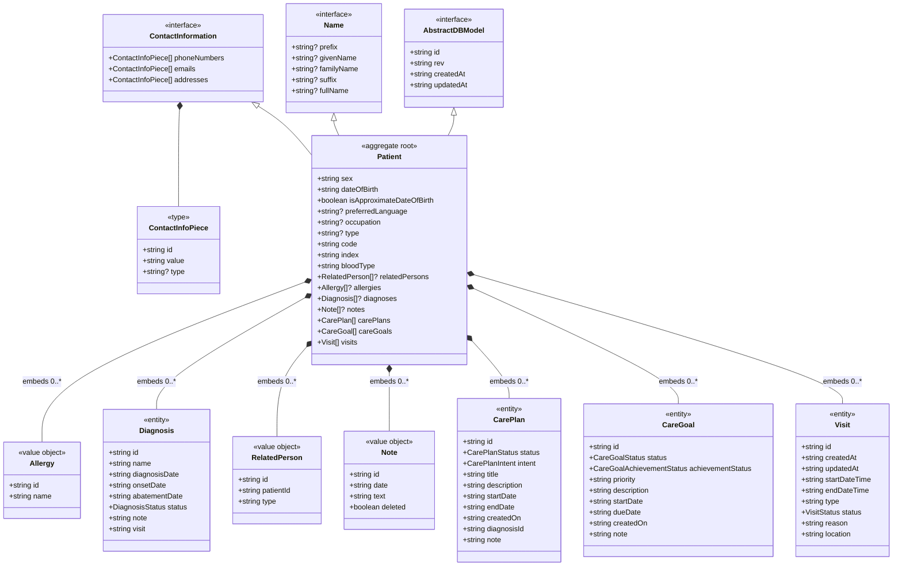

# Patient Entity - Detailed Analysis

**Last Updated:** 2026-04-11  
**Analyzed By:** TrangN via Kiro/bmad

---

## Related Files
- `src/shared/model/Patient.ts` - Patient entity interface
- `src/shared/model/Name.ts` - Name value object
- `src/shared/model/ContactInformation.ts` - Contact info value object
- `src/shared/model/AbstractDBModel.ts` - Base entity interface
- `src/patients/util/validate-patient.ts` - Validation logic
- `src/patients/util/patient-util.ts` - Patient utility functions
- `src/patients/util/set-patient-helper.ts` - Patient data cleanup
- `src/patients/util/is-possible-duplicate-patient.ts` - Duplicate detection
- `src/shared/db/PatientRepository.ts` - Data access layer
- `src/patients/GeneralInformation.tsx` - Patient form UI
- `src/patients/new/NewPatient.tsx` - New patient creation

---

## Table of Contents
1. [Overview](#overview)
2. [Entity Structure Diagram](#entity-structure-diagram)
3. [Field Map Table](#field-map-table)
4. [Validation Rules](#validation-rules)
5. [Business Rules](#business-rules)
6. [Data Transformation](#data-transformation)
7. [Key Insights](#key-insights)
8. [Questions & Todos](#questions--todos)

---

## Overview

The **Patient** entity is the central aggregate root in the HospitalRun domain model. It represents a person receiving or registered to receive medical care at the hospital. The Patient entity extends multiple interfaces (AbstractDBModel, Name, ContactInformation) and embeds several collections (allergies, diagnoses, care plans, visits, etc.).

**Entity Classification:** Aggregate Root  
**Database Type:** PouchDB Document  
**Primary Key:** `id` (string)  
**Business Key:** `code` (auto-generated, format: `P-{shortid}`)  
**Search Index:** `fullName`, `code`

---

## Entity Structure Diagram



---

## Field Map Table

### Core Patient Fields

| Field Name | Data Type | Mandatory | Default Value | Source | Description |
|------------|-----------|-----------|---------------|--------|-------------|
| **id** | string | Yes | Auto-generated (UUID) | AbstractDBModel | Unique identifier for the patient record |
| **rev** | string | Yes | Auto-generated (PouchDB) | AbstractDBModel | Revision number for optimistic locking |
| **createdAt** | string (ISO 8601) | Yes | Auto-generated (timestamp) | AbstractDBModel | Timestamp when patient record was created |
| **updatedAt** | string (ISO 8601) | Yes | Auto-generated (timestamp) | AbstractDBModel | Timestamp when patient record was last updated |
| **code** | string | Yes | Auto-generated (`P-{shortid}`) | Patient | Business identifier for the patient (e.g., `P-abc123XYZ`) |
| **index** | string | Yes | Computed | Patient | Search index field (format: `{fullName} {sex}{code}`) |

### Name Fields (from Name interface)

| Field Name | Data Type | Mandatory | Default Value | Source | Description |
|------------|-----------|-----------|---------------|--------|-------------|
| **prefix** | string | No | undefined | Name | Name prefix (e.g., Dr., Mr., Mrs., Ms.) |
| **givenName** | string | **Yes** | undefined | Name | First name / given name (REQUIRED for validation) |
| **familyName** | string | No | undefined | Name | Last name / family name / surname |
| **suffix** | string | No | undefined | Name | Name suffix (e.g., Jr., Sr., III) |
| **fullName** | string | No | Computed | Name | Full display name (computed from givenName + familyName + suffix) |

### Demographic Fields

| Field Name | Data Type | Mandatory | Default Value | Source | Description |
|------------|-----------|-----------|---------------|--------|-------------|
| **sex** | string | No | undefined | Patient | Patient's sex (values: 'male', 'female', 'other', 'unknown') |
| **dateOfBirth** | string (ISO 8601) | No | undefined | Patient | Date of birth in ISO format |
| **isApproximateDateOfBirth** | boolean | Yes | false | Patient | Flag indicating if DOB is approximate (calculated from age) |
| **bloodType** | string | No | undefined | Patient | Blood type (values: 'A+', 'A-', 'B+', 'B-', 'AB+', 'AB-', 'O+', 'O-', 'unknown') |
| **preferredLanguage** | string | No | undefined | Patient | Patient's preferred language for communication |
| **occupation** | string | No | undefined | Patient | Patient's occupation |
| **type** | string | No | undefined | Patient | Patient type (values: 'charity', 'private') |

### Contact Information Fields (from ContactInformation interface)

| Field Name | Data Type | Mandatory | Default Value | Source | Description |
|------------|-----------|-----------|---------------|--------|-------------|
| **phoneNumbers** | ContactInfoPiece[] | No | [] | ContactInformation | Array of phone numbers with id, value, and optional type |
| **emails** | ContactInfoPiece[] | No | [] | ContactInformation | Array of email addresses with id, value, and optional type |
| **addresses** | ContactInfoPiece[] | No | [] | ContactInformation | Array of physical addresses with id, value, and optional type |

### Embedded Collections

| Field Name | Data Type | Mandatory | Default Value | Source | Description |
|------------|-----------|-----------|---------------|--------|-------------|
| **relatedPersons** | RelatedPerson[] | No | undefined | Patient | Array of related persons (family, emergency contacts) |
| **allergies** | Allergy[] | No | undefined | Patient | Array of patient allergies |
| **diagnoses** | Diagnosis[] | No | undefined | Patient | Array of patient diagnoses |
| **notes** | Note[] | No | undefined | Patient | Array of clinical notes |
| **carePlans** | CarePlan[] | Yes | [] | Patient | Array of care plans (required, defaults to empty array) |
| **careGoals** | CareGoal[] | Yes | [] | Patient | Array of care goals (required, defaults to empty array) |
| **visits** | Visit[] | Yes | [] | Patient | Array of patient visits (required, defaults to empty array) |

---

## Validation Rules

### Field-Level Validation

**Source:** `src/patients/util/validate-patient.ts`

| Field | Rule | Error Message Key | Description |
|-------|------|-------------------|-------------|
| **givenName** | Required (not empty) | `patient.errors.patientGivenNameFeedback` | Given name is mandatory for all patients |
| **dateOfBirth** | Cannot be in the future | `patient.errors.patientDateOfBirthFeedback` | Date of birth must be today or earlier |
| **prefix** | Cannot contain numbers | `patient.errors.patientNumInPrefixFeedback` | Name prefix must be alphabetic only |
| **familyName** | Cannot contain numbers | `patient.errors.patientNumInFamilyNameFeedback` | Family name must be alphabetic only |
| **suffix** | Cannot contain numbers | `patient.errors.patientNumInSuffixFeedback` | Name suffix must be alphabetic only |
| **preferredLanguage** | Cannot contain numbers | `patient.errors.patientNumInPreferredLanguageFeedback` | Language name must be alphabetic only |
| **emails[]** | Must be valid email format | `patient.errors.invalidEmail` | Each email must pass validator.isEmail() check |
| **phoneNumbers[]** | Must be valid mobile phone | `patient.errors.invalidPhoneNumber` | Each phone must pass validator.isMobilePhone() check |

### Validation Logic Details

```typescript
// Required Field Validation
if (!patient.givenName) {
  error.fieldErrors.givenName = 'patient.errors.patientGivenNameFeedback'
}

// Date Validation (cannot be in future)
if (dateOfBirth && isAfter(parseISO(dateOfBirth), new Date())) {
  error.fieldErrors.dateOfBirth = 'patient.errors.patientDateOfBirthFeedback'
}

// No Numbers in Name Fields
if (value && /\d/.test(value)) {
  error.fieldErrors[field] = 'patient.errors.patientNumIn{Field}Feedback'
}

// Email Validation (using validator library)
emails.forEach(email => {
  if (!validator.isEmail(email.value)) {
    error.fieldErrors.emails.push('patient.errors.invalidEmail')
  }
})

// Phone Validation (using validator library)
phoneNumbers.forEach(phone => {
  if (!validator.isMobilePhone(phone.value)) {
    error.fieldErrors.phoneNumbers.push('patient.errors.invalidPhoneNumber')
  }
})
```

### UI-Level Validation

**Source:** `src/patients/GeneralInformation.tsx`

- **givenName**: Marked as `isRequired` in the UI form
- **dateOfBirth**: Has `maxDate={new Date()}` constraint (cannot select future dates)
- **approximateAge**: When `isApproximateDateOfBirth` is true, user enters age (number) and DOB is calculated
- **sex**: Dropdown with predefined options (male, female, other, unknown)
- **type**: Dropdown with predefined options (charity, private)
- **bloodType**: Dropdown with predefined options (A+, A-, B+, B-, AB+, AB-, O+, O-, unknown)

---

## Business Rules

### 1. Patient Code Generation

**Source:** `src/shared/db/PatientRepository.ts`, `src/shared/util/generateCode.ts`

**Rule:** Patient codes are automatically generated when a patient is saved.

**Format:** `P-{shortid}`
- Prefix: `P` (for Patient)
- Separator: `-`
- ID: Generated using `shortid.generate()` (URL-safe, unique, short identifier)

**Example Codes:** `P-abc123XYZ`, `P-9Kx2mN4pQ`, `P-aBc_DeF-12`

**Implementation:**
```typescript
// In PatientRepository.save()
async save(entity: Patient): Promise<Patient> {
  const patientCode = generateCode('P')  // Returns "P-{shortid}"
  entity.code = patientCode
  const saveResult = await super.save(entity)
  return this.find(saveResult.id)
}
```

**Characteristics:**
- Auto-generated on save (cannot be manually set)
- Unique across all patients
- URL-safe characters
- Short and human-readable
- Immutable once created

### 2. Full Name Computation

**Source:** `src/patients/util/set-patient-helper.ts`, `src/patients/util/patient-util.ts`

**Rule:** The `fullName` field is computed from name components before saving.

**Formula:** `{givenName} {familyName} {suffix}` (trimmed, spaces normalized)

**Implementation:**
```typescript
export function getPatientName(givenName?: string, familyName?: string, suffix?: string) {
  let name = ''
  name = appendNamePart(name, givenName)
  name = appendNamePart(name, familyName)
  name = appendNamePart(name, suffix)
  return name.trim()
}

// In cleanupPatient()
newPatient.fullName = getPatientName(givenName, familyName, suffix)
```

**Examples:**
- `givenName: "John"` → `fullName: "John"`
- `givenName: "John", familyName: "Doe"` → `fullName: "John Doe"`
- `givenName: "John", familyName: "Doe", suffix: "Jr."` → `fullName: "John Doe Jr."`

### 3. Search Index Generation

**Source:** `src/patients/util/set-patient-helper.ts` (implied), `src/shared/db/PatientRepository.ts`

**Rule:** The `index` field is used for full-text search and includes name, sex, and code.

**Format:** `{fullName} {sex}{code}`

**Example:** `"John Doe Jr. maleP-abc123XYZ"`

**Database Index:**
```typescript
relationalDb.createIndex({
  index: { fields: ['_id', 'data.fullName', 'data.code'] }
})
```

**Search Implementation:**
```typescript
async search(text: string): Promise<Patient[]> {
  return super.search({
    selector: {
      $or: [
        { 'data.fullName': { $regex: RegExp(escapedString, 'i') } },
        { 'data.code': text }
      ]
    }
  })
}
```

**Search Behavior:**
- Case-insensitive search on `fullName`
- Exact match on `code`
- Supports partial name matching
- Special characters are escaped for regex safety

### 4. Duplicate Patient Detection

**Source:** `src/patients/util/is-possible-duplicate-patient.ts`, `src/patients/new/NewPatient.tsx`

**Rule:** Before creating a new patient, the system checks for possible duplicates.

**Duplicate Criteria:** A patient is considered a possible duplicate if ALL of the following match:
1. `givenName` (exact match)
2. `familyName` (exact match)
3. `sex` (exact match)
4. `dateOfBirth` (exact match)

**Implementation:**
```typescript
export function isPossibleDuplicatePatient(newPatient: Patient, existingPatient: Patient) {
  return (
    newPatient.givenName === existingPatient.givenName &&
    newPatient.familyName === existingPatient.familyName &&
    newPatient.sex === existingPatient.sex &&
    newPatient.dateOfBirth === existingPatient.dateOfBirth
  )
}
```

**User Experience:**
- If duplicates are found, a modal dialog is shown
- User can choose to continue creating the duplicate or cancel
- System does NOT prevent duplicate creation (warning only)

### 5. Contact Information Cleanup

**Source:** `src/patients/util/set-patient-helper.ts`

**Rule:** Empty contact information entries are removed before saving.

**Cleanup Logic:**
- Filter out entries where `value.trim() === ''`
- Trim whitespace from all values
- If all entries are empty, delete the entire array field
- Preserve `id` and `type` fields for non-empty entries

**Implementation:**
```typescript
const contactInformationKeys = ['phoneNumbers', 'emails', 'addresses']
contactInformationKeys.forEach((key) => {
  const nonEmpty = newPatient[key]
    .filter(({ value }) => value.trim() !== '')
    .map((entry) => {
      const newValue = entry.value.trim()
      return { id: entry.id, value: newValue, type: entry.type }
    })

  if (nonEmpty.length > 0) {
    newPatient[key] = nonEmpty
  } else {
    delete newPatient[key]
  }
})
```

### 6. Approximate Date of Birth

**Source:** `src/patients/GeneralInformation.tsx`

**Rule:** When exact date of birth is unknown, users can enter an approximate age.

**Calculation Logic:**
```typescript
const guessDateOfBirthFromApproximateAge = (value: string) => {
  const age = Number.isNaN(parseFloat(value)) ? 0 : parseFloat(value)
  const dateOfBirth = subYears(new Date(Date.now()), age)
  return startOfDay(dateOfBirth).toISOString()
}
```

**Behavior:**
- User checks "Unknown Date of Birth" checkbox
- UI switches from date picker to age input (number field)
- System calculates DOB as `today - age years` at start of day
- `isApproximateDateOfBirth` flag is set to `true`
- Supports decimal ages (e.g., 5.5 years)

**Example:**
- User enters age: `25`
- Current date: `2026-04-11`
- Calculated DOB: `2001-04-11T00:00:00.000Z`
- `isApproximateDateOfBirth: true`

### 7. Visits Initialization

**Source:** `src/patients/util/set-patient-helper.ts`

**Rule:** The `visits` array is always initialized to an empty array if undefined.

**Implementation:**
```typescript
newPatient.visits = newPatient.visits ?? []
```

**Rationale:** Ensures `visits` is always an array (never undefined) for consistent data access.

### 8. Enumerated Field Values

**Source:** `src/patients/GeneralInformation.tsx`

**Sex Values:**
- `male`
- `female`
- `other`
- `unknown`

**Patient Type Values:**
- `charity` - Charity/free care patient
- `private` - Private/paying patient

**Blood Type Values:**
- `A+`, `A-`
- `B+`, `B-`
- `AB+`, `AB-`
- `O+`, `O-`
- `unknown`

---

## Data Transformation

### Save Pipeline

```
User Input (Form)
    ↓
GeneralInformation Component
    ↓
Patient Object (partial)
    ↓
cleanupPatient() - Remove empty contacts, compute fullName
    ↓
validatePatient() - Check validation rules
    ↓
PatientRepository.save()
    ↓
generateCode('P') - Add patient code
    ↓
PouchDB relationalDb.rel.save('patient', entity)
    ↓
Saved Patient (with id, rev, code, fullName)
```

### Load Pipeline

```
PatientRepository.find(id)
    ↓
PouchDB relationalDb.rel.find('patient', id)
    ↓
Patient Object (with all fields)
    ↓
GeneralInformation Component (display mode)
    ↓
Rendered UI
```

### Search Pipeline

```
User Search Input (text)
    ↓
PatientRepository.search(text)
    ↓
Escape special regex characters
    ↓
PouchDB Query:
  - Regex match on fullName (case-insensitive)
  - OR exact match on code
    ↓
Patient[] results
    ↓
ViewPatientsTable Component
    ↓
Rendered search results
```

---

## Key Insights

💡 **Auto-Generated Business Key**  
The `code` field is automatically generated using `shortid` with a `P-` prefix. This provides a human-readable, URL-safe identifier that's shorter than UUIDs but still globally unique. The code is immutable once created.

💡 **Computed Fields Pattern**  
Both `fullName` and `index` are computed fields derived from other attributes. This denormalization improves search performance and display consistency but requires careful maintenance during updates.

💡 **Flexible Date of Birth**  
The system supports both exact and approximate dates of birth through the `isApproximateDateOfBirth` flag. This is critical for healthcare in developing countries where exact birth dates may not be known.

💡 **Duplicate Detection is Advisory Only**  
The duplicate patient detection warns users but does not prevent duplicate creation. This is a business decision that prioritizes data entry speed over strict uniqueness, trusting healthcare workers to make the right decision.

💡 **Embedded vs. Referenced Collections**  
Patient embeds small collections (allergies, diagnoses, notes, visits) directly in the document, while larger collections (appointments, labs, medications, imagings) are stored as separate documents with foreign keys. This hybrid approach balances query performance with document size limits.

⚠️ **No Validation on Save**  
The `PatientRepository.save()` method does NOT call `validatePatient()`. Validation is only performed in the UI layer. This means invalid data could be saved if validation is bypassed or if data is imported programmatically.

⚠️ **Contact Info Validation Limitations**  
Phone number validation uses `validator.isMobilePhone()` which may not work correctly for all international formats. Email validation is more robust but still relies on regex patterns.

⚠️ **Name Field Number Restriction**  
The validation prevents numbers in name fields (prefix, givenName, familyName, suffix, preferredLanguage), but this may be overly restrictive for some cultures or edge cases (e.g., "Louis XIV", "3rd Battalion").

⚠️ **Document Size Risk**  
Embedding all visits, diagnoses, and notes in the Patient document could cause PouchDB document size limits to be exceeded for patients with extensive medical histories. No pagination or archiving strategy is evident.

🔗 **Search Index Strategy**  
The system creates a compound index on `_id`, `fullName`, and `code` for efficient searching. The search supports both partial name matching (regex) and exact code matching, covering the two most common search patterns.

🔗 **Cleanup Before Save**  
The `cleanupPatient()` function normalizes data by removing empty contact entries and computing derived fields. This ensures data consistency but happens in the UI layer, not the repository layer.

🔗 **Relational Queries**  
The PatientRepository provides convenience methods (`getAppointments()`, `getLabs()`, `getMedications()`) that leverage relational-pouch to query related entities, abstracting the complexity of NoSQL joins.

---

## Questions & Todos

### Questions

1. **Why is validation only in the UI layer?** Should `PatientRepository.save()` also validate to prevent invalid data from being saved programmatically?

2. **What happens when a patient document exceeds PouchDB size limits?** Is there a strategy for archiving old visits/diagnoses?

3. **Why is the `index` field separate from the search index?** Could this be computed on-the-fly during search instead of stored?

4. **Can patient codes be changed after creation?** The code appears immutable, but is there a business need to reassign codes?

5. **What is the `type` field used for?** The UI shows "charity" vs "private" options, but how does this affect billing or access control?

6. **Why are `carePlans`, `careGoals`, and `visits` required (non-optional) while other collections are optional?** What's the business rationale?

7. **How are related persons linked?** The `RelatedPerson.patientId` suggests a related person can also be a patient. How is this bidirectional relationship managed?

8. **What happens if duplicate detection finds multiple matches?** The UI only shows one duplicate patient in the modal.

9. **Why does phone validation use `isMobilePhone()` instead of `isPhone()`?** This excludes landlines, which may be important for emergency contacts.

10. **Is there a maximum length for name fields?** No validation checks for excessively long names.

### Todos

- [ ] Document the complete lifecycle of a patient record (create → update → archive/delete)
- [ ] Analyze the patient update flow in `src/patients/edit/EditPatient.tsx`
- [ ] Document the relationship between Patient and User (who creates/updates patients?)
- [ ] Map out all places where patient validation is performed (UI vs. API vs. repository)
- [ ] Investigate the `index` field generation logic (not found in current code scan)
- [ ] Document the patient search UI and filtering capabilities
- [ ] Analyze the duplicate patient modal UX flow
- [ ] Document the permissions required for patient CRUD operations
- [ ] Create sequence diagrams for: Create Patient, Update Patient, Search Patient
- [ ] Document the patient export/import functionality (if any)
- [ ] Analyze the patient history view and how it aggregates data from related entities
- [ ] Document the relationship between visits and other clinical entities (labs, diagnoses)
- [ ] Investigate if there's a soft delete mechanism for patients
- [ ] Document the patient merge functionality (if any) for resolving duplicates
- [ ] Analyze the performance implications of embedded collections at scale

---

**End of Document**
