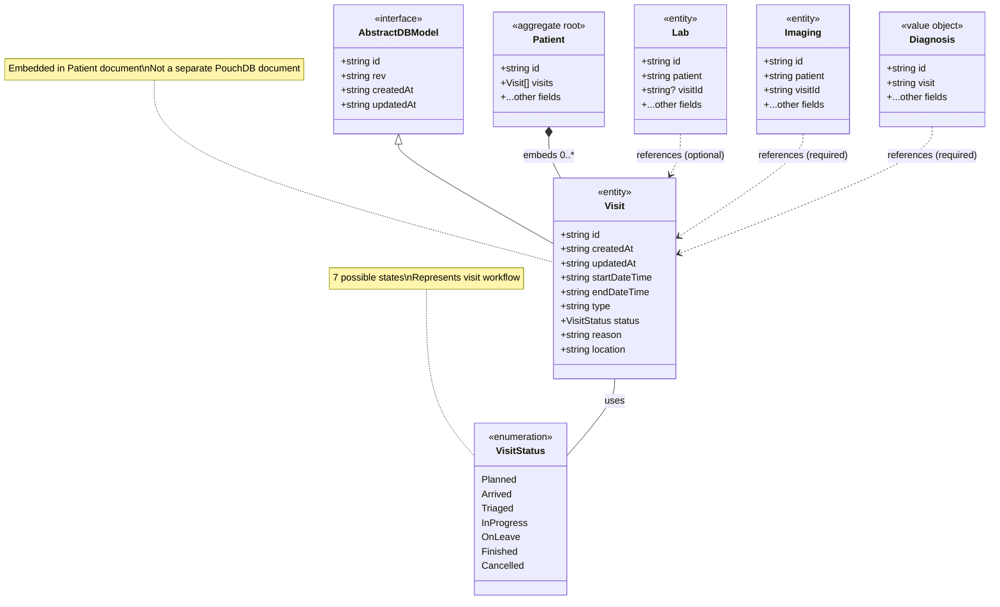
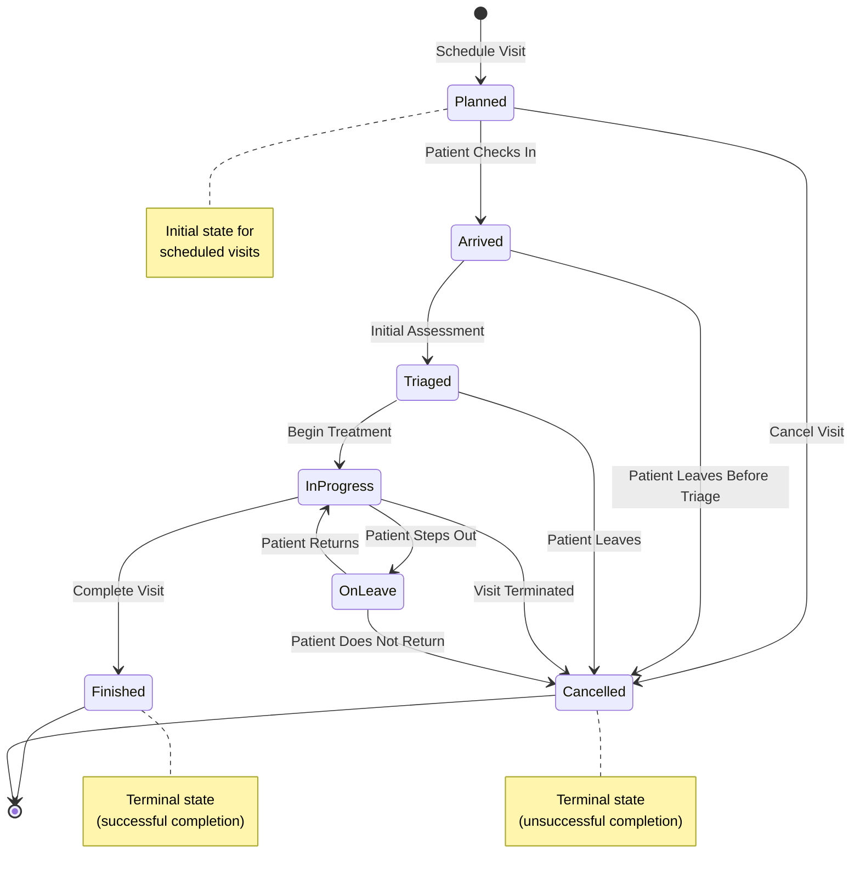

# Visit Entity - Detailed Analysis

**Last Updated:** 2026-04-11  
**Analyzed By:** TrangN via Kiro/bmad

---

## Related Files
- `src/shared/model/Visit.ts` - Visit entity interface and status enumeration
- `src/patients/visits/AddVisitModal.tsx` - Visit creation modal
- `src/patients/visits/VisitForm.tsx` - Visit form component
- `src/patients/visits/VisitTab.tsx` - Visit tab container
- `src/patients/visits/ViewVisit.tsx` - Visit detail view
- `src/patients/visits/VisitTable.tsx` - Visit list table
- `src/patients/hooks/useAddVisit.tsx` - Visit creation hook
- `src/patients/hooks/useVisit.tsx` - Visit retrieval hook
- `src/patients/util/validate-visit.ts` - Visit validation logic
- `src/shared/model/Lab.ts` - Lab entity (references visitId)
- `src/shared/model/Imaging.ts` - Imaging entity (references visitId)
- `src/shared/model/Diagnosis.ts` - Diagnosis entity (references visit)

---

## Table of Contents
1. [Overview](#overview)
2. [Entity Structure Diagram](#entity-structure-diagram)
3. [Field Map Table](#field-map-table)
4. [Status Lifecycle](#status-lifecycle)
5. [Validation Rules](#validation-rules)
6. [Integration Points](#integration-points)
7. [Business Rules](#business-rules)
8. [Key Insights](#key-insights)
9. [Questions & Todos](#questions--todos)

---

## Overview

The **Visit** entity represents a patient encounter or episode of care at the hospital. It tracks a single visit session from planning/arrival through discharge. Visits are embedded within the Patient document and serve as a temporal context for clinical activities such as labs, imaging, and diagnoses.

**Entity Classification:** Entity (Embedded in Patient Aggregate)  
**Storage Pattern:** Embedded in Patient document as array  
**Primary Key:** `id` (string, UUID)  
**Parent Entity:** Patient (one-to-many relationship)  
**Referenced By:** Lab (optional), Imaging (required), Diagnosis (required)

---

## Entity Structure Diagram



---

## Field Map Table

| Field Name | Data Type | Mandatory | Default Value | Description |
|------------|-----------|-----------|---------------|-------------|
| **id** | string | Yes | Auto-generated (UUID) | Unique identifier for the visit (generated via `uuid()`) |
| **createdAt** | string (ISO 8601) | Yes | Auto-generated (timestamp) | Timestamp when visit record was created |
| **updatedAt** | string (ISO 8601) | Yes | Auto-generated (timestamp) | Timestamp when visit record was last updated |
| **startDateTime** | string (ISO 8601) | **Yes** | Current date/time | Date and time when the visit starts or started |
| **endDateTime** | string (ISO 8601) | **Yes** | Current date + 1 month | Date and time when the visit ends or is expected to end |
| **type** | string | **Yes** | Empty string | Type or category of visit (free-text field, e.g., "emergency", "routine", "follow-up") |
| **status** | VisitStatus | **Yes** | Empty string | Current status of the visit in its lifecycle (see Status Lifecycle section) |
| **reason** | string | **Yes** | Empty string | Reason for the visit or chief complaint (free-text field) |
| **location** | string | **Yes** | Empty string | Physical location where the visit takes place (e.g., "ER", "Ward 3", "Clinic A") |
| **rev** | string | Yes | Inherited from AbstractDBModel | Revision number (inherited but not actively used for embedded entities) |

### Field Notes

**Inherited from AbstractDBModel:**
- `id`, `rev`, `createdAt`, `updatedAt` are inherited from AbstractDBModel interface
- However, since Visit is embedded in Patient, the `rev` field is not used for optimistic locking at the Visit level

**Date/Time Fields:**
- All date/time fields use ISO 8601 format (e.g., `"2026-04-11T14:30:00.000Z"`)
- `startDateTime` and `endDateTime` support both past and future dates
- Default `endDateTime` is set to 1 month after `startDateTime` in the UI

**Free-Text Fields:**
- `type`, `reason`, and `location` are free-text fields with no predefined values
- No character limits are enforced in the model (UI may have limits)

---

## Status Lifecycle

### Status Enumeration

**Source:** `src/shared/model/Visit.ts`

```typescript
export enum VisitStatus {
  Planned = 'planned',
  Arrived = 'arrived',
  Triaged = 'triaged',
  InProgress = 'in progress',
  OnLeave = 'on leave',
  Finished = 'finished',
  Cancelled = 'cancelled',
}
```

### Status Definitions

| Status | Value | Description | Typical Use Case |
|--------|-------|-------------|------------------|
| **Planned** | `'planned'` | Visit is scheduled but patient has not yet arrived | Pre-scheduled appointments, future visits |
| **Arrived** | `'arrived'` | Patient has checked in and is waiting to be seen | Patient at reception, waiting room |
| **Triaged** | `'triaged'` | Initial assessment completed, priority assigned | Emergency department triage, vital signs taken |
| **In Progress** | `'in progress'` | Visit is actively occurring, patient is being treated | Doctor consultation, examination in progress |
| **On Leave** | `'on leave'` | Patient temporarily left during the visit | Patient went for external test, stepped out temporarily |
| **Finished** | `'finished'` | Visit completed normally, patient discharged | Normal visit completion, patient left facility |
| **Cancelled** | `'cancelled'` | Visit was cancelled and did not occur | No-show, patient cancelled, rescheduled |

### Status Transition Diagram



### Status Transition Rules

**Current Implementation:**
- ⚠️ **No enforced state machine**: The system does NOT enforce status transitions. Users can select any status at any time via dropdown.
- Status changes are manual and user-driven through the UI
- No automatic status transitions based on time or events
- No validation prevents invalid transitions (e.g., Finished → Planned)

**Recommended Transitions (Not Enforced):**

| From Status | Valid Next Statuses | Business Logic |
|-------------|---------------------|----------------|
| Planned | Arrived, Cancelled | Patient arrives or cancels |
| Arrived | Triaged, Cancelled | Triage or patient leaves |
| Triaged | In Progress, Cancelled | Begin treatment or patient leaves |
| In Progress | On Leave, Finished, Cancelled | Patient steps out, completes, or terminates |
| On Leave | In Progress, Cancelled | Patient returns or doesn't return |
| Finished | *(terminal)* | No further transitions |
| Cancelled | *(terminal)* | No further transitions |

---

## Validation Rules

### Field-Level Validation

**Source:** `src/patients/util/validate-visit.ts`

| Field | Rule | Error Message Key | Description |
|-------|------|-------------------|-------------|
| **startDateTime** | Required (not empty) | `patient.visits.error.startDateRequired` | Start date/time is mandatory |
| **endDateTime** | Required (not empty) | `patient.visits.error.endDateRequired` | End date/time is mandatory |
| **endDateTime** | Must be after startDateTime | `patient.visits.error.endDateMustBeAfterStartDate` | End date must be chronologically after start date |
| **type** | Required (not empty) | `patient.visits.error.typeRequired` | Visit type is mandatory |
| **status** | Required (not empty) | `patient.visits.error.statusRequired` | Visit status is mandatory |
| **reason** | Required (not empty) | `patient.visits.error.reasonRequired` | Visit reason is mandatory |
| **location** | Required (not empty) | `patient.visits.error.locationRequired` | Visit location is mandatory |

### Validation Logic

```typescript
export default function validateVisit(visit: Partial<Visit>) {
  const error: AddVisitError = {}

  // Required field validations
  if (!visit.startDateTime) {
    error.startDateTime = 'patient.visits.error.startDateRequired'
  }

  if (!visit.endDateTime) {
    error.endDateTime = 'patient.visits.error.endDateRequired'
  }

  if (!visit.type) {
    error.status = 'patient.visits.error.typeRequired'
  }

  if (!visit.status) {
    error.status = 'patient.visits.error.statusRequired'
  }

  if (!visit.reason) {
    error.status = 'patient.visits.error.reasonRequired'
  }

  if (!visit.location) {
    error.status = 'patient.visits.error.locationRequired'
  }

  // Date logic validation
  if (visit.startDateTime && visit.endDateTime) {
    if (isBefore(new Date(visit.endDateTime), new Date(visit.startDateTime))) {
      error.endDateTime = 'patient.visits.error.endDateMustBeAfterStartDate'
    }
  }

  return error
}
```

### UI-Level Validation

**Source:** `src/patients/visits/VisitForm.tsx`

- All fields are marked as `isRequired` in the form
- `startDateTime` and `endDateTime` use DateTimePicker components
- `status` uses a dropdown populated from `VisitStatus` enum values
- `type`, `reason`, and `location` are free-text input fields
- Form validation occurs on submit, not on field blur

---

## Integration Points

### 1. Embedded in Patient (Composition)

**Relationship Type:** Composition (Strong Ownership)  
**Storage Pattern:** Embedded Array  
**Cardinality:** Patient (1) → Visits (0..*)

**Implementation:**
```typescript
// In Patient.ts
export default interface Patient extends AbstractDBModel, Name, ContactInformation {
  // ... other fields
  visits: Visit[]  // Required field, defaults to empty array
}
```

**Data Access:**
```typescript
// Adding a visit
async function addVisit(request: AddVisitRequest): Promise<Visit[]> {
  const patient = await PatientRepository.find(request.patientId)
  const visits = patient.visits || ([] as Visit[])
  visits.push({
    id: uuid(),
    createdAt: new Date(Date.now().valueOf()).toISOString(),
    ...request.visit,
  })
  await PatientRepository.saveOrUpdate({
    ...patient,
    visits,
  })
  return visits
}

// Retrieving a specific visit
async function fetchVisit(patientId: string, visitId: string): Promise<Visit | undefined> {
  const { visits } = await PatientRepository.find(patientId)
  return visits.find(({ id }) => id === visitId) || undefined
}
```

**Characteristics:**
- Visits are stored as an array within the Patient document
- No separate PouchDB collection for visits
- Visits are loaded/saved with the entire Patient document
- Deleting a patient deletes all associated visits (cascade delete)
- No independent lifecycle for visits outside of patient context

### 2. Referenced by Lab (Optional)

**Relationship Type:** Association (Weak Reference)  
**Storage Pattern:** Foreign Key (`visitId`)  
**Cardinality:** Visit (1) → Labs (0..*)  
**Optionality:** Optional (Lab.visitId is optional)

**Implementation:**
```typescript
// In Lab.ts
export default interface Lab extends AbstractDBModel {
  // ... other fields
  visitId?: string  // Optional reference to visit
}
```

**Use Case:**
- Labs can be associated with a specific visit for context
- Labs can exist without a visit association (standalone orders)
- Useful for grouping labs by visit/encounter

### 3. Referenced by Imaging (Required)

**Relationship Type:** Association (Weak Reference)  
**Storage Pattern:** Foreign Key (`visitId`)  
**Cardinality:** Visit (1) → Imagings (0..*)  
**Optionality:** Required (Imaging.visitId is mandatory)

**Implementation:**
```typescript
// In Imaging.ts
export default interface Imaging extends AbstractDBModel {
  // ... other fields
  visitId: string  // Required reference to visit
}
```

**Use Case:**
- All imaging requests must be associated with a visit
- Provides context for when/why imaging was ordered
- Enables visit-based reporting and billing

### 4. Referenced by Diagnosis (Required)

**Relationship Type:** Association (Weak Reference)  
**Storage Pattern:** Foreign Key (`visit`)  
**Cardinality:** Visit (1) → Diagnoses (0..*)  
**Optionality:** Required (Diagnosis.visit is mandatory)

**Implementation:**
```typescript
// In Diagnosis.ts
export default interface Diagnosis {
  // ... other fields
  visit: string  // Required reference to visit
}
```

**Use Case:**
- Diagnoses are made during a specific visit
- Links diagnosis to the encounter when it was identified
- Supports visit-based clinical documentation

### Integration Architecture

```
┌─────────────────────────────────────────────────────────┐
│                    Patient Document                      │
│  ┌────────────────────────────────────────────────────┐ │
│  │ id: "patient-123"                                  │ │
│  │ fullName: "John Doe"                               │ │
│  │ visits: [                                          │ │
│  │   {                                                │ │
│  │     id: "visit-abc",                               │ │
│  │     startDateTime: "2026-04-11T09:00:00Z",         │ │
│  │     status: "in progress",                         │ │
│  │     ...                                            │ │
│  │   },                                               │ │
│  │   { id: "visit-xyz", ... }                         │ │
│  │ ]                                                  │ │
│  │ diagnoses: [                                       │ │
│  │   { id: "diag-1", visit: "visit-abc", ... }       │ │◄─┐
│  │ ]                                                  │ │  │
│  └────────────────────────────────────────────────────┘ │  │
└─────────────────────────────────────────────────────────┘  │
                                                              │
┌─────────────────────────────────────────────────────────┐  │
│                    Lab Document                          │  │
│  id: "lab-456"                                          │  │
│  patient: "patient-123"                                 │  │
│  visitId: "visit-abc"  ◄────────────────────────────────┼──┤
│  type: "Blood Test"                                     │  │
│  status: "completed"                                    │  │
└─────────────────────────────────────────────────────────┘  │
                                                              │
┌─────────────────────────────────────────────────────────┐  │
│                  Imaging Document                        │  │
│  id: "imaging-789"                                      │  │
│  patient: "patient-123"                                 │  │
│  visitId: "visit-abc"  ◄────────────────────────────────┼──┘
│  type: "X-Ray"                                          │
│  status: "requested"                                    │
└─────────────────────────────────────────────────────────┘

Legend:
  ═══ Embedded (Composition)
  ─── Referenced (Association)
```

---

## Business Rules

### 1. Visit ID Generation

**Rule:** Visit IDs are automatically generated using UUID when a visit is created.

**Implementation:**
```typescript
// In useAddVisit.tsx
visits.push({
  id: uuid(),  // Generate unique ID
  createdAt: new Date(Date.now().valueOf()).toISOString(),
  ...request.visit,
})
```

**Characteristics:**
- Uses `uuid()` function (likely UUID v4)
- Generated client-side before saving
- Immutable once created
- Globally unique across all visits

### 2. Default Date/Time Values

**Rule:** When creating a new visit, default values are provided for date/time fields.

**Implementation:**
```typescript
// In AddVisitModal.tsx
const initialVisitState = {
  startDateTime: new Date().toISOString(),  // Current date/time
  endDateTime: addMonths(new Date(), 1).toISOString(),  // 1 month from now
  // ... other fields
}
```

**Rationale:**
- `startDateTime` defaults to current time (visit starting now)
- `endDateTime` defaults to 1 month later (reasonable default for visit duration)
- Users can modify these defaults as needed

### 3. Visit Validation on Save

**Rule:** All required fields must be present and valid before a visit can be saved.

**Implementation:**
```typescript
async function addVisit(request: AddVisitRequest): Promise<Visit[]> {
  const error = validateVisit(request.visit)
  if (isEmpty(error)) {
    // Save visit
  } else {
    error.message = 'patient.visits.error.unableToAdd'
    throw error
  }
}
```

**Validation Checks:**
- All required fields present
- `endDateTime` is after `startDateTime`
- Throws error if validation fails

### 4. Visit Embedded Storage

**Rule:** Visits are stored as an array within the Patient document, not as separate documents.

**Implications:**
- Loading a patient loads all visits
- Updating a visit requires loading and saving the entire patient document
- No separate query capability for visits across patients
- Visit count contributes to patient document size

### 5. No Status Transition Enforcement

**Rule:** The system does NOT enforce status transitions. Users can change status to any value at any time.

**Current Behavior:**
- Status dropdown shows all 7 status values
- No validation prevents illogical transitions (e.g., Finished → Planned)
- No automatic status changes based on time or events
- Status changes are entirely manual and user-driven

**Implications:**
- Flexible but prone to data quality issues
- Relies on user training and discipline
- No audit trail of status changes
- Potential for inconsistent data

### 6. Visit Type is Free-Text

**Rule:** Visit type is a free-text field with no predefined values or validation.

**Observed Values (from tests):**
- "emergency"
- "routine"
- "standard type"
- "follow-up" (implied)

**Implications:**
- Flexible but inconsistent
- No standardized reporting by visit type
- Potential for typos and variations
- Could benefit from enumeration or dropdown

### 7. Visit Location is Free-Text

**Rule:** Visit location is a free-text field with no predefined values or validation.

**Observed Values (from tests):**
- "main"
- "main building"
- "ER" (implied)
- "Ward 3" (implied)

**Implications:**
- Flexible but inconsistent
- No standardized location tracking
- Difficult to generate location-based reports
- Could benefit from location master data

### 8. Permission-Based Access

**Rule:** Creating visits requires the `AddVisit` permission.

**Implementation:**
```typescript
// In VisitTab.tsx
{permissions.includes(Permissions.AddVisit) && (
  <Button onClick={() => setShowAddVisitModal(true)}>
    {t('patient.visits.new')}
  </Button>
)}
```

**Permissions:**
- `Permissions.AddVisit` - Required to create new visits
- `Permissions.ReadVisits` - Required to view visits (implied)

---

## Key Insights

💡 **Embedded Entity Pattern**  
Visits are embedded within the Patient document rather than stored as separate documents. This optimizes for the common access pattern (loading all visits with a patient) but limits scalability for patients with many visits.

💡 **Temporal Context for Clinical Activities**  
Visits serve as a temporal grouping mechanism for clinical activities (labs, imaging, diagnoses). This enables visit-based reporting and billing, which is critical for healthcare operations.

💡 **Flexible Status Workflow**  
The 7-state status enumeration provides a detailed workflow from planning through completion, covering common healthcare scenarios like triage, temporary leave, and cancellation.

💡 **No Referential Integrity Enforcement**  
Labs, imaging, and diagnoses reference visits by ID, but there's no database-level referential integrity. Orphaned references are possible if visits are deleted or IDs are changed.

💡 **Manual Status Management**  
Status transitions are entirely manual with no enforcement or automation. This provides flexibility but requires user discipline and training to maintain data quality.

⚠️ **No Status Transition Validation**  
The system allows any status transition at any time, including illogical ones (e.g., Finished → Planned). This could lead to data quality issues and reporting inaccuracies.

⚠️ **Free-Text Type and Location**  
Visit type and location are free-text fields with no standardization. This makes reporting and analytics difficult and is prone to inconsistencies.

⚠️ **Document Size Risk**  
Embedding all visits in the Patient document could cause PouchDB document size limits to be exceeded for patients with extensive visit histories (e.g., chronic disease patients with hundreds of visits).

⚠️ **No Visit Update Capability**  
The codebase shows visit creation and viewing, but no explicit visit update/edit functionality. Users may need to delete and recreate visits to make changes.

⚠️ **No Visit Deletion Capability**  
No delete functionality is evident in the codebase. Visits may be permanent once created, or deletion may only be possible by editing the patient document directly.

🔗 **Weak Reference Pattern**  
Labs, imaging, and diagnoses reference visits using string IDs. This is a weak reference pattern that provides flexibility but requires manual integrity management.

🔗 **Query Cache Integration**  
The visit hooks use React Query's query cache for optimistic updates and caching, improving UI responsiveness when adding visits.

🔗 **Permission-Based UI**  
The UI conditionally renders the "Add Visit" button based on user permissions, implementing role-based access control at the presentation layer.

---

## Questions & Todos

### Questions

1. **Why are visits embedded instead of separate documents?** What is the expected maximum number of visits per patient? At what point does document size become a problem?

2. **Is there visit update/edit functionality?** The codebase shows creation and viewing, but no editing. How do users correct mistakes?

3. **Is there visit deletion functionality?** How are erroneous visits removed? Is there a soft delete mechanism?

4. **Why is status transition not enforced?** Was this a deliberate design decision for flexibility, or is it a missing feature?

5. **Should visit type and location be enumerated?** Would standardized values improve reporting and data quality?

6. **How are orphaned visit references handled?** If a visit is deleted (somehow), what happens to labs/imaging/diagnoses that reference it?

7. **What is the relationship between Visit and Appointment?** Are they the same concept or different? Can an appointment become a visit?

8. **Why is Lab.visitId optional but Imaging.visitId required?** What's the business rationale for this difference?

9. **How are visit durations calculated?** Is there reporting on average visit duration by type or status?

10. **Are there any automatic status transitions?** For example, does a visit automatically move to "Finished" when endDateTime is reached?

11. **What happens to visits when a patient is deleted?** Are they cascade deleted, or is patient deletion prevented if visits exist?

12. **Is there a visit search or filter capability?** Can users find visits across all patients by date range, status, or type?

### Todos

- [ ] Document the complete visit lifecycle (create → view → update? → delete?)
- [ ] Investigate if visit update functionality exists elsewhere in the codebase
- [ ] Investigate if visit deletion functionality exists
- [ ] Document the relationship between Visit and Appointment entities
- [ ] Analyze visit-based reporting capabilities (if any)
- [ ] Document how visit references are validated when creating labs/imaging/diagnoses
- [ ] Create sequence diagrams for: Add Visit, View Visit, Update Visit (if exists)
- [ ] Analyze the performance implications of embedded visits at scale
- [ ] Document the visit search/filter UI (if any)
- [ ] Investigate if there's a visit merge or split capability
- [ ] Document the audit trail for visit status changes (if any)
- [ ] Analyze the visit duration calculation logic (if any)
- [ ] Document the visit export/import functionality (if any)
- [ ] Investigate if there's a mechanism to prevent orphaned visit references
- [ ] Document the visit-based billing or reporting features (if any)
- [ ] Analyze the query performance for finding visits across all patients
- [ ] Document the visit archiving strategy (if any)
- [ ] Investigate if there's a visit template or quick-create feature
- [ ] Document the visit notification or reminder system (if any)
- [ ] Analyze the visit concurrency handling (multiple users editing same patient)

---

**End of Document**
